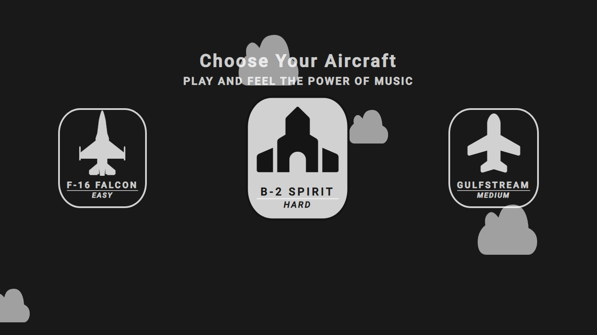
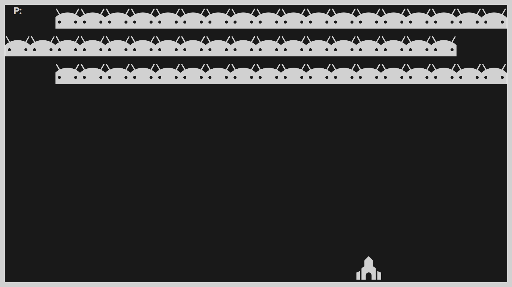
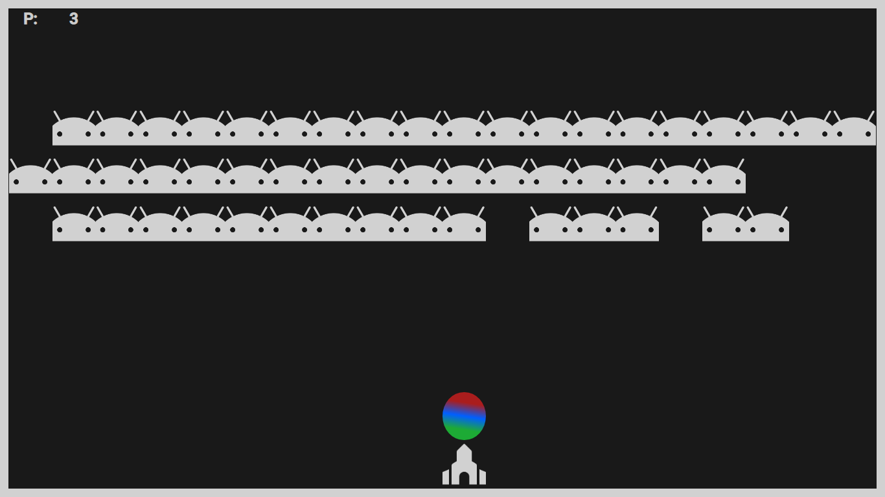
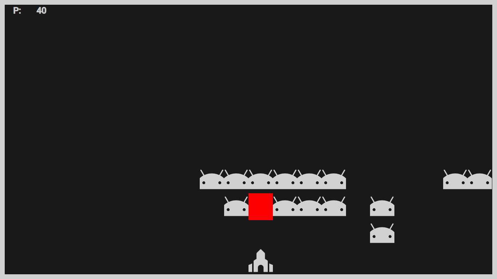
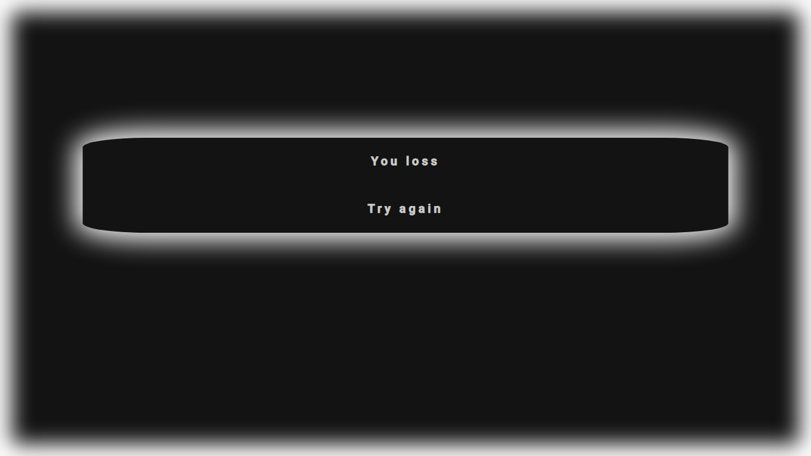

# Simple Shoot Game

### After load the game we must choose our aircarf

#
#
### Than we start the game. 
We click: 
#### -- move left -> left arrow 
#### -- move right -> right arrow
#### -- shoot -> spacebar

#
#
### When we click spacebar our aircarft fires a colored ball
#### Missile launch makes a sound similar to firing

#
#
### When our bullet hits one of the enemy he dies during the animation

##### "P:" = means point
##### One opponent = one point

#
#
### When we kill all enemys we win or when our opponents they will overcome the entire board and come to us we lost the game
#### For the end we just click in the button and game start again

